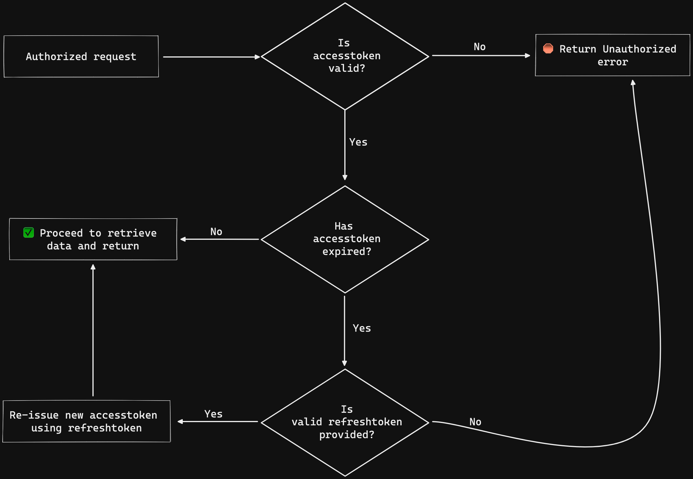

## For the purpose to learn typescript in Node.js Project

### Concepts
- REST API principals
  - CRUD
  - HTTP methods
- JWT & refresh tokens
- Request validation

### Tech
- Node.js
- MongoDB with Mongoose
- TypeScript
- Express.js & Express.js middlewares
- [Zod](https://www.npmjs.com/package/zod) validation

### API workflow

### Access & refresh token flow
